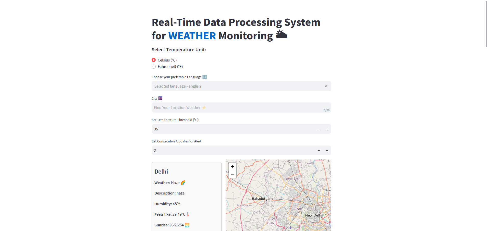
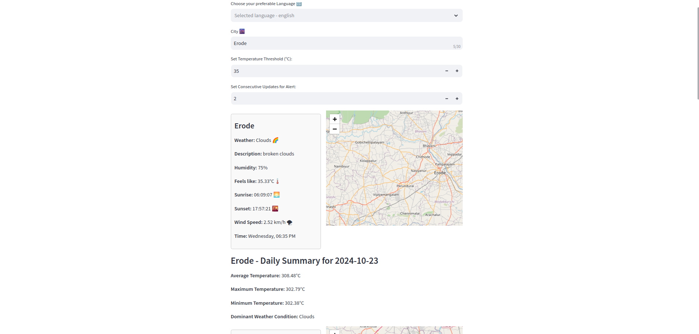

# Real-Time Weather Monitoring System

## Project Overview

This project is a Real-Time Data Processing System for Weather Monitoring that continuously tracks weather conditions across major Indian cities, provides insights through rollups and aggregates, and triggers alerts based on user-defined thresholds. The system fetches weather data from the [OpenWeatherMap API](https://openweathermap.org/) at configurable intervals and processes it to generate daily summaries, detect anomalies, and visualize trends.

## Key Features

- **Continuous Weather Monitoring:** The system retrieves real-time weather data for major metro cities in India, including Delhi, Mumbai, Chennai, Bangalore, Kolkata, and Hyderabad.
- **Daily Weather Summaries:** Aggregates weather data throughout the day to calculate average temperature, maximum temperature, minimum temperature, and the most frequent weather condition.
- **Threshold-Based Alerts:** Users can set temperature thresholds and consecutive update requirements to trigger alerts if conditions are met.
- **Visualizations:** Displays real-time weather data and interactive maps for each city using Folium. Visualizes historical weather trends and alerts.

## Project Structure

```bash
├── main.py                 # Main script for running the Streamlit app
├── weather_summary.db      # SQLite database for storing daily weather summaries
├── .env                    # Environment file for storing API key
├── requirements.txt        # Python dependencies
└── README.md               # Project documentation
```
## Screenshots
*Main interface of the application.*

*Example of weather data visualization.*

## How It Works

1. **Data Retrieval:**
    - The system connects to the OpenWeatherMap API and retrieves weather data for the configured cities at a set interval (default: 10 seconds).
    - The user can select a preferred language for weather descriptions from a range of options.
2. **Temperature Conversion:**
    - Temperature data fetched from the API is initially in Kelvin. It is converted to Celsius or Fahrenheit based on user preferences.
3. **Threshold Alerts:**

    - Users can define temperature thresholds (e.g., 35°C) and specify the number of consecutive updates required for triggering an alert.
    - If the temperature exceeds the threshold for the specified number of updates, a visual alert is displayed in the app.
4. **Data Aggregation:**

    - The system aggregates daily weather data to compute average, maximum, and minimum temperatures, as well as the most frequent weather condition.
    - Data is stored in an SQLite database for further analysis and historical insights.
5. **Visualization:**

    - Weather data and alerts are displayed on an interactive map.
    - Daily weather summaries are shown in a user-friendly format.

## Configuration
1. **API Key Setup:**
    - Sign up for a free API key from OpenWeatherMap.
    - Store the API key in a .env file as   `API_KEY=Your_Open_Weather_API_Key`.
2. **Dependencies Installation:**
    - Install the required dependencies using:
    ```bash
    pip install -r requirements.txt
    ```
    - Required Python libraries include:
        - `streamlit`, `requests`, `folium`, `pytz`, `sqlite3`, `dotenv`,`streamlit-folium` 
3. **Database Initialization:**
    - The SQLite database `(weather_summary.db)` will be automatically created and initialized with a `daily_summary` table if it does not exist.

## Running the Application

1. **Start the Streamlit app:**
    ```bash
    streamlit run Main.py
    ```
2. **Monitor Weather Conditions:**
    - Enter a city name to fetch real-time weather data.
    - Set alert thresholds and view weather data visualizations.

3. **View Daily Summaries:**
    - Daily weather summaries for selected cities can be accessed and reviewed.
## System Features

### Rollups and Aggregates

1. **Daily Weather Summary:**
    - Roll up the weather data for each day.
    - Calculate the following aggregates:
        - Average Temperature: The mean of all temperature readings.
        - Maximum Temperature: The highest recorded temperature.
        - Minimum Temperature: The lowest recorded temperature.
        - Dominant Weather Condition: The most frequent weather condition during the day (calculated using the `Counter` class for simplicity).

2. **Alerting Thresholds:**
    - Alerts can be configured to trigger if the temperature exceeds a specified threshold for consecutive updates.
    - Alerts are displayed within the application.


3. **Visualizations:**
    - **Interactive Maps:** Folium maps display the current location of cities being monitored.
    - **Weather Information Panels:** Show real-time weather data, including temperature, humidity, sunrise/sunset times, and wind speed.
